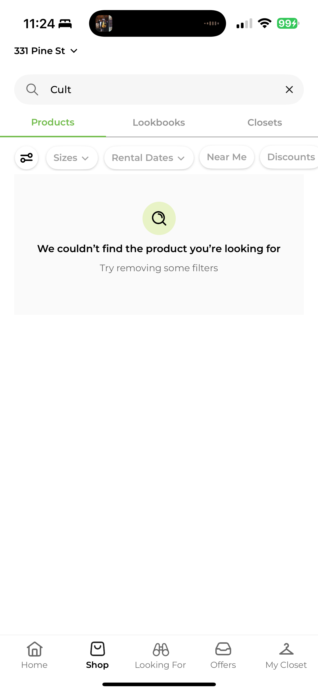
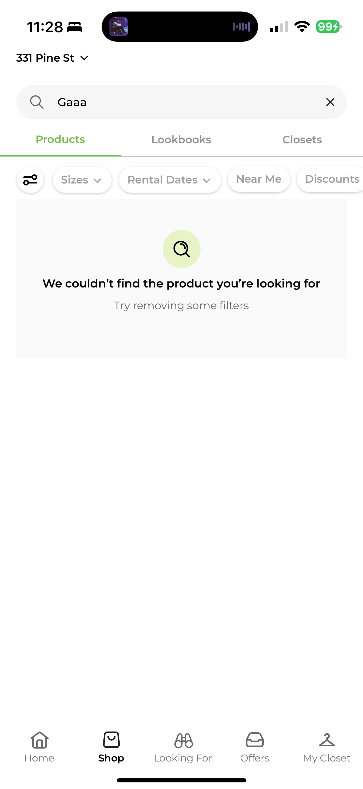
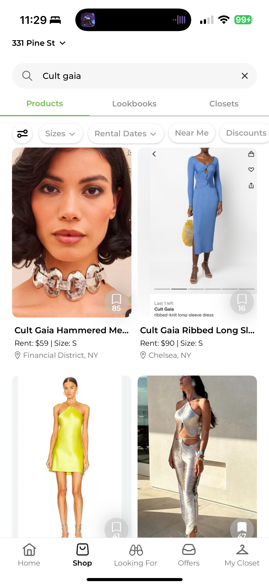
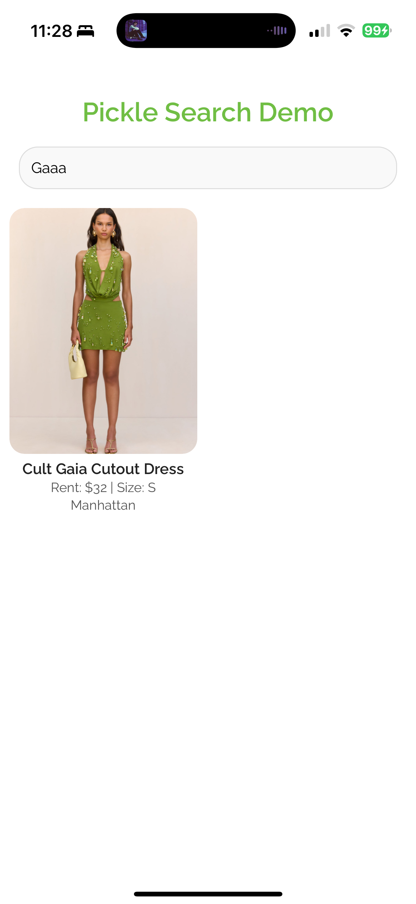
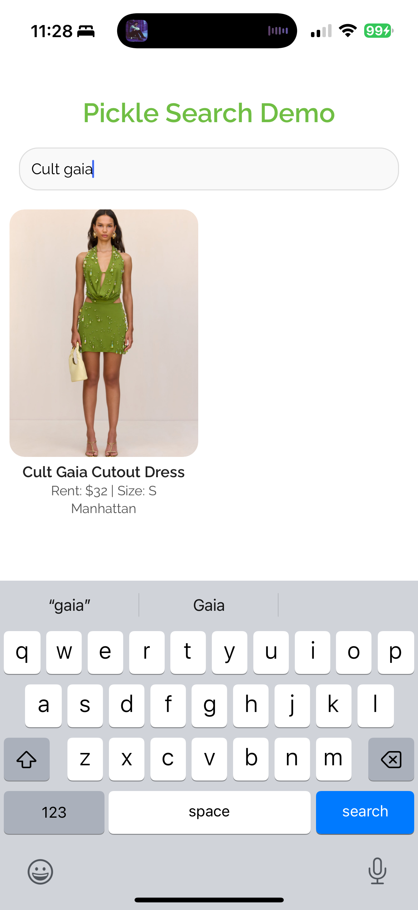

# 🥒 Pickle Search Demo

This is a lightweight React Native demo exploring how fuzzy search can be used to match users to clothing items. The app allows users to search a list of mock fashion items with brand, color, and style tags. Results are matched using Fuse.js to enable intuitive, typo friendly discovery.

## Get started

   ```bash
      git clone https://github.com/J-Walters/pickle-search-demo
      cd pickle-search-demo
      npm install
      npx expo start
   ```


In the output, you'll find options to open the app in a

- [development build](https://docs.expo.dev/develop/development-builds/introduction/)
- [Android emulator](https://docs.expo.dev/workflow/android-studio-emulator/)
- [iOS simulator](https://docs.expo.dev/workflow/ios-simulator/)
- [Expo Go](https://expo.dev/go), a limited sandbox for trying out app development with Expo


## Why Fuse.js?

This version uses Fuse.js for speed, transparency, and a more scalable path to real-world implementation. It handles:
- Partial matches
- Misspellings
- Ranking results by relevance


## Screenshots

### Current Behavior

<p align="center">
   
   
   
</p>

### Demo

<p align="center">
   
   
   
</p>

[Watch Video Demo](assets/videos/pickle-search-demo.MP4)

## Notes
  This is a concept demo. It's not hooked up to a backend and built using static data. 


